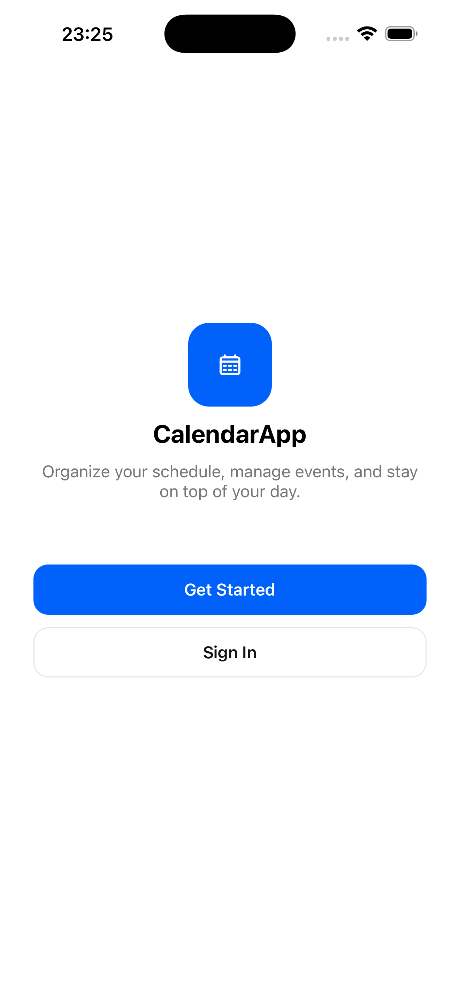
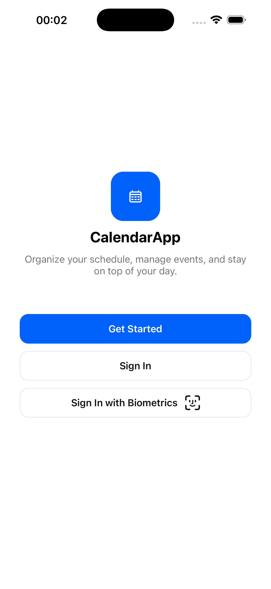
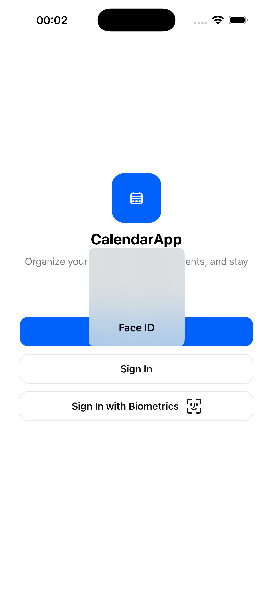
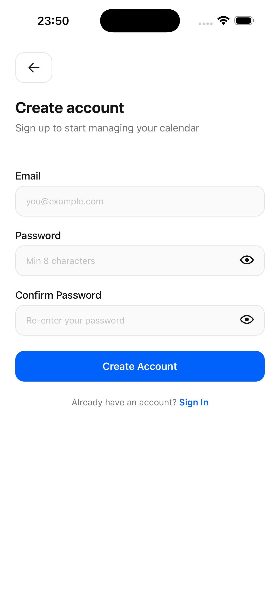
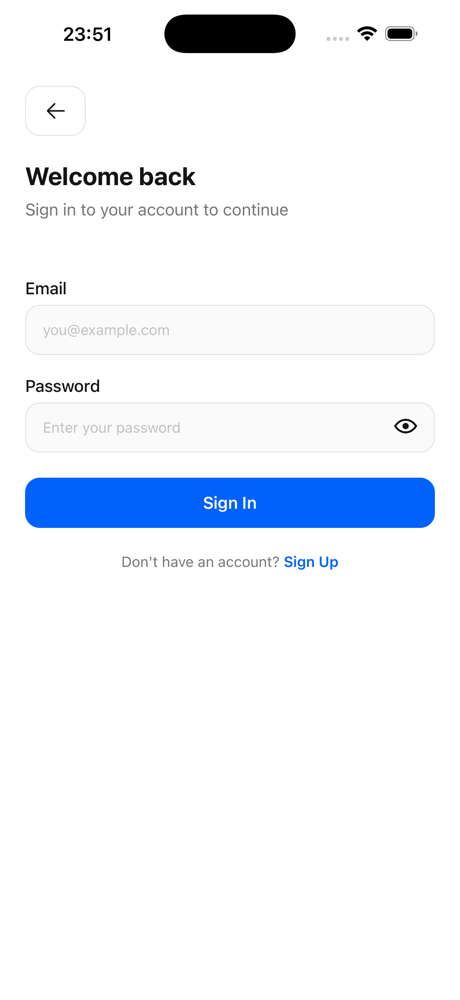
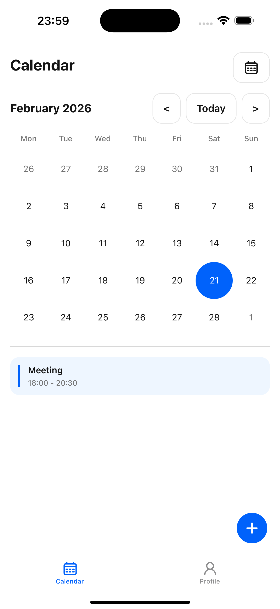
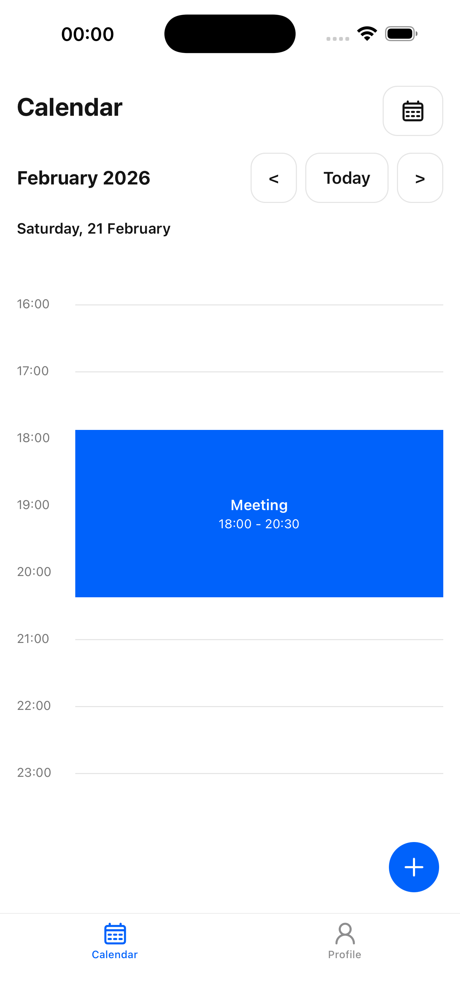
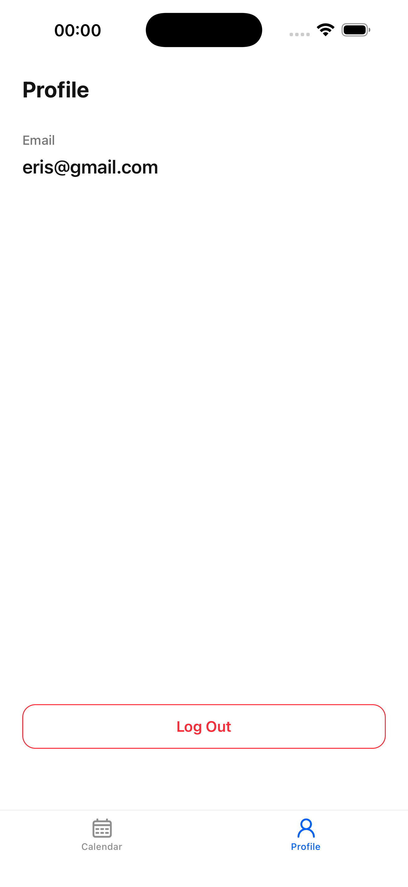

# CalendarTask

CalendarTask is a React Native mobile app for managing personal events with a clean calendar workflow. It includes local authentication, optional biometric sign-in, day/month calendar views, and event CRUD.

## Features

- Sign up and sign in with form validation (Zod + React Hook Form)
- Optional biometric sign-in (Face ID / Touch ID) when a saved session exists
- Calendar navigation with day and month views
- Create, edit, and delete events with date range selection
- Profile screen with current user info and logout
- Local-first data storage using AsyncStorage

## Screenshots

### Onboarding and Authentication

| Landing                             | First-time Signed In                                                          | Biometric Sign In                                        |
| ----------------------------------- | ----------------------------------------------------------------------------- | -------------------------------------------------------- |
|  |  |  |

| Sign Up                                   | Sign In                                   |
| ----------------------------------------- | ----------------------------------------- |
|  |  |

### Calendar and Events

| Calendar (Month)                                 | Calendar (Day)                                     |
| ------------------------------------------------ | -------------------------------------------------- |
|  |  |

| Create Event                                         | Edit Event                                       |
| ---------------------------------------------------- | ------------------------------------------------ |
|  |  |

### Profile

| Profile                                    |
| ------------------------------------------ |
|  |

## Tech Stack

- React Native `0.84`
- TypeScript
- Redux Toolkit + RTK Query
- React Navigation
- React Hook Form + Zod
- Day.js

## Prerequisites

- Node.js `>= 22.11.0`
- npm
- React Native development environment (Android Studio and/or Xcode)

Before running the app, complete the official React Native environment setup:

- https://reactnative.dev/docs/set-up-your-environment

## Installation

```sh
npm install
```

For iOS (first setup and when native dependencies change):

```sh
bundle install
bundle exec pod install
```

## Running the App

1. Start Metro:

```sh
npm start
```

2. In another terminal, run a platform target:

```sh
npm run android
# or
npm run ios
```

## Available Scripts

- `npm start` - Start Metro bundler
- `npm run android` - Build and run Android app
- `npm run ios` - Build and run iOS app
- `npm run clean:ios` - Clean iOS build artifacts and reinstall Pods
- `npm run lint` - Run ESLint
- `npm run lint:fix` - Run ESLint with auto-fixes
- `npm test` - Run Jest tests

## Project Structure

```text
src/
  assets/
  components/
  hooks/
  navigations/
  schemas/
  screens/
  store/
  styles/
  types/
```

## Notes

- Authentication and events are persisted locally (AsyncStorage) for demo/offline-first behavior.
- Biometric sign-in depends on device support and an existing saved session token.
